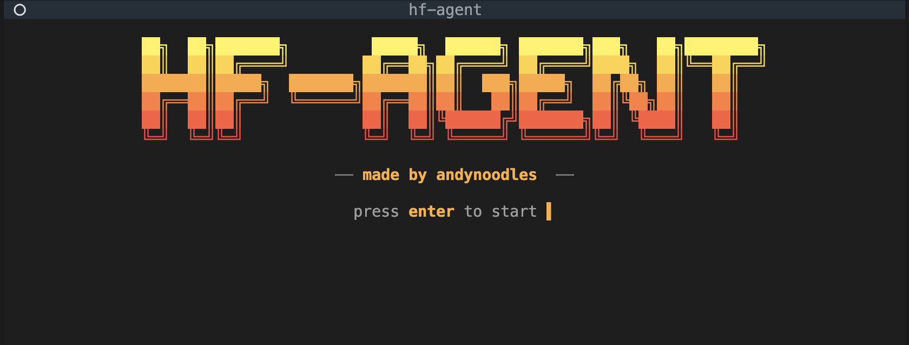

# hf-agent



A terminal agent that takes a natural-language question, picks a Hugging
Face Hub or Datasets-Server endpoint, calls it for real, and answers
from the response.

The interface is a Textual TUI for interactive use, plus a headless
driver (`uv run main.py "<query>"`) for the break-it harness and any
non-interactive run.

For the assignment writeup — domain choice, design decisions, Part 1
break/harden cycle, Part 2 multi-model eval and results — see
[`WRITEUP.md`](./WRITEUP.md).

## Setup

Python 3.12+, [`uv`](https://github.com/astral-sh/uv).

```bash
uv venv
source .venv/bin/activate
uv pip install -r requirements.txt
cp .env.example .env   # add your API keys and Model ids
uv run main.py
```

`.env`:

```ini
# --- OpenAI (or any OpenAI-compatible endpoint, e.g. Ollama, vLLM, OpenRouter) ---
OPENAI_API_KEY=paste-your-key-here
# Default https://openrouter.ai/api/v1 ; change for compatible providers
OPENAI_BASE_URL=https://openrouter.ai/api/v1

# Single model, or comma-separated list shown in /models
OPENAI_MODELS=nvidia/nemotron-3-super-120b-a12b:free,openrouter/owl-alpha,poolside/laguna-m.1:free,qwen/qwen3-next-80b-a3b-instruct:free

# --- Google Gemini ---
GEMINI_API_KEY=paste-your-key-here
GEMINI_MODEL=gemma-4-31b-it,gemma-4-26b-a4b-it,gemini-3.1-flash-lite-preview

HF_TOKEN=paste-your-token-here  # optional — raises rate limits, unlocks gated datasets
```

Either provider can be left blank; the app uses whichever keys are set.

## Usage

Type a message and hit Enter. Slash commands:

| Command | What it does |
|---------|--------------|
| `/models` | Open the model picker |
| `/tool` | List registered tools |
| `/<tool>` | Nudge the next turn to use a specific tool (e.g. `/hf_hub_search trending diffusion models`) |
| `/loop <goal>` | Autonomous mode: forced auto-approve, 100-round cap, doom-loop guard |
| `/auto` | Toggle auto-approve for tool calls |
| `/clear` | Clear chat history |
| `/help` | List all commands |
| `/quit` | Exit |

`Ctrl+L` clear, `Ctrl+C` quit, `Esc` close modal, `y`/`n`/`a`
accept/deny/approve-and-auto on tool prompts.

### Headless mode

```bash
uv run main.py "find me 3 popular text classification datasets on huggingface"
uv run main.py --model gemma-4-31b-it --json "show rows 100-109 of imdb test"
```

Tools that mutate the host (`run_shell`) are dropped from the active
tool set in headless mode — there is no human in the loop to approve
them.

## Tools

Each tool is a thin wrapper that maps named arguments onto exactly one
HTTP call. Adding a new tool is one decorator call (see below); both
the OpenAI and Gemini providers automatically advertise it on the
next turn.

| Tool | Maps to | Used for |
|------|---------|----------|
| `hf_hub_search` | `GET /api/{kind}?search=…&filter=…&sort=…` | "find models / datasets / spaces matching X" |
| `hf_dataset_viewer` | `GET /{endpoint}?dataset=…&config=…&split=…&…` | look at the actual rows / splits / size / stats |
| `http_get` | `GET <any url>` | escape hatch for endpoints not covered above |
| `web_search` | DuckDuckGo HTML | discovery — "what is this dataset called on the Hub?" |
| `run_shell` | `/bin/sh -c …` | introspection / scripting (approval-gated, denied in headless) |

### Approval flow (TUI)

- `y` — approve once
- `a` — approve and switch on auto-approve for the rest of the session
- `n` / `Esc` — deny; the model is told the call was refused

If a command runs longer than `timeout_seconds` (default 30), the
process is **not** killed automatically — you get a "⏳ still running"
prompt asking whether to keep waiting another window. The command is
killed only if you decline.

### Adding a new tool

Drop a module into `hf_agent/tools/` and decorate an async function:

```python
# hf_agent/tools/files.py
from . import tool

@tool(
    name="read_file",
    description="Read a UTF-8 text file and return its contents.",
    parameters={
        "type": "object",
        "properties": {"path": {"type": "string"}},
        "required": ["path"],
    },
    requires_approval=False,
)
async def read_file(path: str) -> str:
    with open(path, encoding="utf-8") as f:
        return f.read()
```

Add the module name to `_BUILTIN_TOOLS` in `hf_agent/tools/__init__.py`.

A tool can also ask the user a yes/no question mid-execution by reading
the current `ToolContext`:

```python
from . import context as tool_context, tool

@tool(...)
async def my_tool(...) -> str:
    ctx = tool_context.get()
    if ctx and not await ctx.confirm("Proceed?", "About to do something risky."):
        return "User declined."
    ...
```

## Project layout

```
.
├── main.py                       # entry: load .env, TUI or headless one-shot
├── requirements.txt
├── .env / .env.example
├── ASSIGNMENT.md                 # take-home prompt
├── WRITEUP.md                    # design + Part 1/Part 2 writeup
├── scripts/break_it.py           # 12 adversarial NL queries → transcripts/
├── evals/                        # Part 2 — multi-model eval harness
└── hf_agent/
    ├── app.py                    # ChatApp: layout, streaming + tool loop
    ├── headless.py               # one-shot driver for break-it + scripted runs
    ├── config.py                 # ModelChoice, available_models()
    ├── providers.py              # OpenAI + Gemini streaming with tool events
    ├── commands.py               # slash command registry
    ├── command_input.py          # Input subclass with Tab-complete
    ├── message_view.py           # per-turn message bubble (Markdown body)
    ├── model_select.py           # /models picker modal
    ├── approval.py               # tool-call approval modal
    ├── confirm.py                # generic yes/no modal
    ├── spinner.py                # animated thinking spinner
    ├── doom_loop.py              # repetition guard for /loop mode
    └── tools/
        ├── __init__.py           # registry + @tool decorator + ToolContext
        ├── terminal.py           # run_shell (approval-gated)
        ├── web_search.py         # DuckDuckGo HTML search
        ├── http_get.py           # generic HTTP GET
        ├── hf_hub_search.py      # Hub: models / datasets / spaces
        └── hf_dataset_viewer.py  # Datasets Server proxy
```
